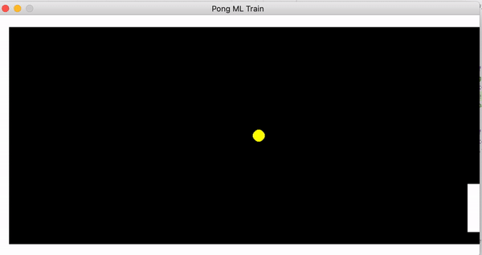
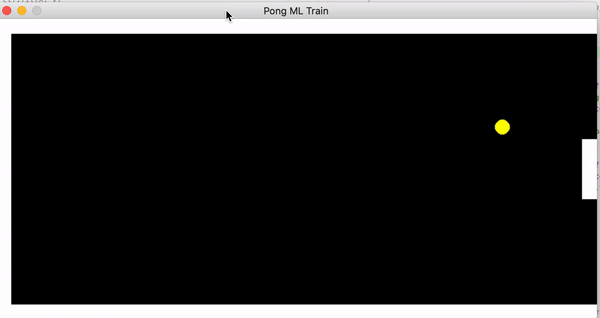

# Pong Lab: ML Player

## Introduction
Create an AI agent for the single player Pong-like game.

## Steps

1. Create your own training file:  
Make sure to set  `train = True` around lab4.py line 94 to record your states.  
Play the game until you have a satisfying csv recording. 

2. Train: 
- Look at your csv and decide on your ML model:  
	Supervised/unsupervised?  
	Classification / regression / clustering?  
	https://scikit-learn.org/stable/tutorial/machine_learning_map/index.html

- Create a separate notebook/script, train.py:  
Create X/y matrices: What should be your features vs output?  
See 5.2/12a: X_iris/y_iris setup via pd.drop()  
Train and save your ML model  
See class examples or [dsexample](https://github.com/memoatwit/dsexample/blob/master/Insurance%20-%20Model%20Training%20Notebook.ipynb)  
Save your model to be used in the game, where `model` is the name of your scikit model:
```python
	from joblib import dump, load 
	dump(model, 'mymodel.joblib') #save  
```
3. Deploy:  
- go back to lab4.py, set `train = False` around line 94
- load your model in the `if not train` block, around line 150: 
```python
	from joblib import dump, load 
	model = load('mymodel.joblib')  #load
```
- finally, complete the logic to predict the desired paddle postion/direction and to control the paddle to that location. 


## Example
Here are two different types fo models from two different training sets playing solo:





