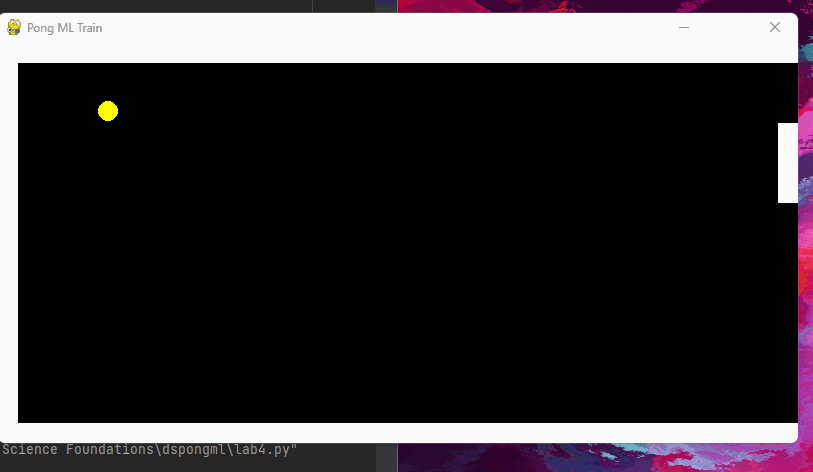

# Pong Lab: ML Player
Example of Play:

I found that Linear Regression worked best using ball_x, ball_y, ball_vx, and ball_vy as the X features and paddle_y as the y label.

On average the game lasted 4.28 seconds

